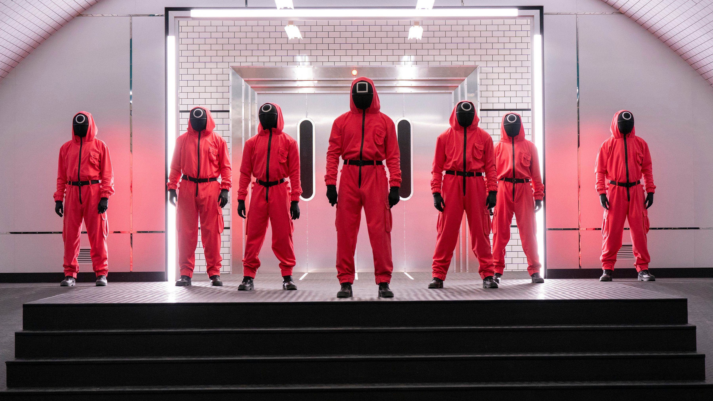
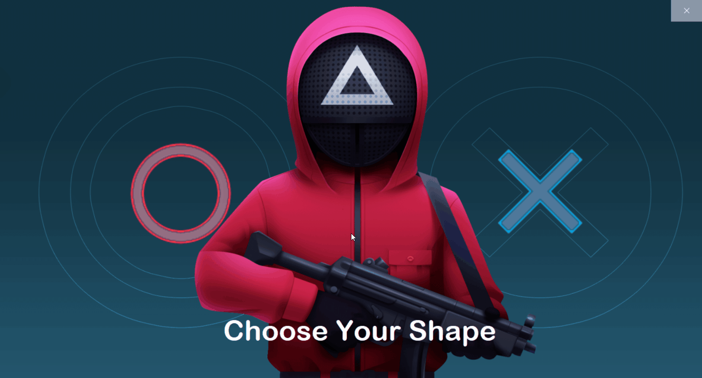
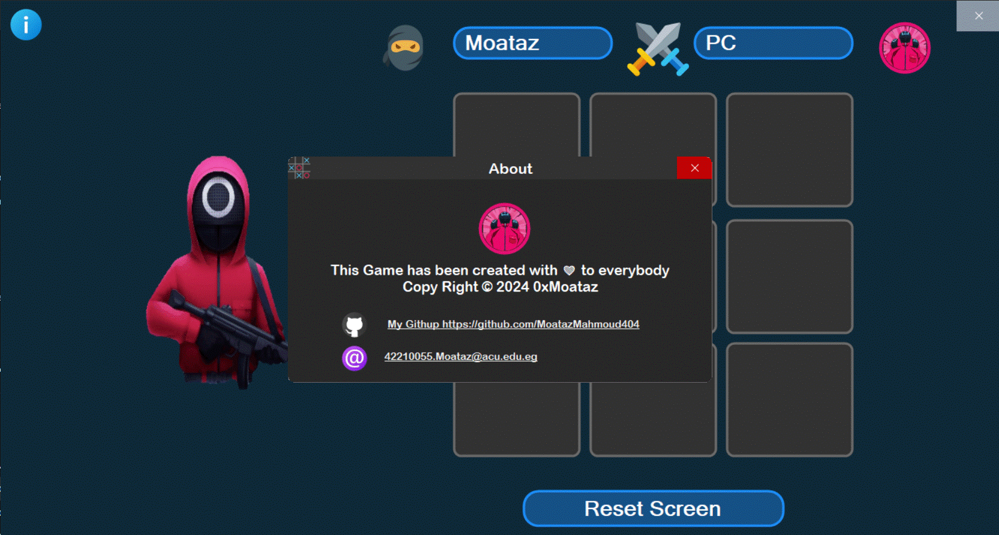

I'm a student at Ahram Canadian University, studying in the College of Computer Science & AI. I'm passionate about programming and game development, which led me to create this project as a part of my coursework. I enjoy combining creativity with technical skills to build engaging applications.

#  Tic Tac Toe Game 

Welcome to the ultimate showdown of strategy and wit, where the classic game of Tic Tac Toe meets the gripping world of Squid Game!. This project is a Windows Forms application developed using C# .Net

##  Course Information

- **Course**: Event-Driven and Reactive Programming
- **Course Code**: CSC207
- **Group**: D4
- **Student ID**: 42210055
- **Instructor**: Dr. Ahmed Seif
- **Teaching Assistants**:
  - Eng. Monica Elkess
  - Eng. Youssef Hashem

##  Table of Contents

- [Course Information](#course-information)
- [Introduction](#introduction)
- [Features](#features)
- [Installation](#installation)
- [Usage](#usage)
- [Contributing](#contributing)
- [Executable File](#executable-file)
- [Screenshots and Videos](#screenshots-and-videos)
- [Contact](#contact)
- [Update Version 2.0.0](#update-version-200)

##  Introduction

This project is a simple implementation of the classic Tic-Tac-Toe game built using Windows Forms. It allows users to play against a computer opponent. The game features sound effects and a graphical user interface for an enjoyable gaming experience.

##  Features

- Play against a computer opponent
- Interactive graphical user interface
- Sound effects for various game events
- Option to restart the game

##  Installation

To run this project locally, follow these steps:

1. Clone this repository to your local machine.
2. Open the project in Visual Studio or any other C# IDE.
3. Ensure that you have the necessary dependencies installed, including .NET Framework and any required packages.
4. Compile and run the project.

Ensure that you have the following frameworks installed:

- **Guna UI Framework**: Used for enhancing the UI elements of the application.
- **Shade Library**: Used for creating shadow effects in the UI.

##  Usage

Once the project is compiled and running, you can start playing the Tic-Tac-Toe game. Here's how to play:

1. Choose your preferred shape (X or O) and enter your name.
2. Click on the grid buttons to place your shape.
3. The computer opponent will make its move automatically.
4. Continue playing until one player wins or the game ends in a draw.
5. You can restart the game at any time by clicking the restart button.

##  Contributing

Contributions to this project are welcome <3. If you find any issues or have suggestions for improvements, feel free to open an issue or submit a pull request on GitHub.

##  Executable File

You can also find the executable file (`TicTacToe.exe`) in the repository's `bin` directory. You can directly run this executable file on a Windows system without needing to compile the project.

##  Screenshots and Videos

Here are some screenshots and small video snippets showcasing different aspects of the application:

- **Intro Screen**:
  
    
  This GIF shows the introduction screen of the application.

- **Choose Your Shape**:
  
    
  This PNG demonstrates the process of choosing your preferred shape (X or O) in the application.

- **Game Play**:
  
    
  This GIF illustrates the gameplay of the Tic-Tac-Toe game.
  
- **About**:

    
  This PNG displays information about the application.
  
##  Contact

For any inquiries or feedback, please contact with me at 42210055.Moataz@acu.edu.eg

---

This Game has been created with ❤️ to everybody  
Copy Right © 2024 0xMoataz

---
##  Update version 2.0.0
- The table with descriptions of the features that come in update version 2.0.0 soon

| Feature                                          | Description                                                                                             |
|--------------------------------------------------|---------------------------------------------------------------------------------------------------------|
| Customizable Character and Color Selection       | Users can now choose their preferred character (X or O) and customize its color to personalize their gaming experience. |
| Score Tracking                                   | The game now keeps track of the user's score by storing the results of the matches they've played, including wins, losses, and draws. |
| High Score Board                                 | A high score board has been added to showcase the top-performing players. Users can compete to achieve the highest score and secure their place on the board. |
| Multiplayer Mode                                 | Players can choose to play against another human player locally, adding a social aspect to the game. This mode supports playing against friends or family members on the same device. |
| Navigation Improvements                          | Users can navigate back to the main menu from any point in the game, providing a more seamless and intuitive user experience. |
| Resizable Window                                 | The game window is now resizable, allowing users to adjust the size of the game board and interface to their preference. |
| Minimize Window                                  | Users can minimize the game window to the taskbar, enabling them to multitask or switch between applications without closing the game. |
| Multi-Level AI Difficulty                        | Three levels of AI difficulty have been introduced: Easy, Medium, and Hard. Players can choose the level that suits their skill level or challenge themselves by facing tougher opponents. |
| Improved AI Logic                                | The AI opponents have been enhanced with more sophisticated decision-making algorithms, providing a more challenging and engaging gameplay experience. |
| Undo Move Feature                                | Users can now undo their last move, allowing them to reconsider their strategy and make better decisions during gameplay. |
| Improved Sound Effects and Visuals               | Additional sound effects and visual enhancements have been added to further immerse players in the gaming environment. |
| Optimized Performance                            | Various optimizations have been implemented to improve the overall performance and responsiveness of the game. |
| Bug Fixes                                        | Several bugs and issues reported by users have been addressed to ensure a smoother and more enjoyable gaming experience. |
| Compatibility Updates                            | The game has been updated to ensure compatibility with the latest operating systems and hardware configurations. |
